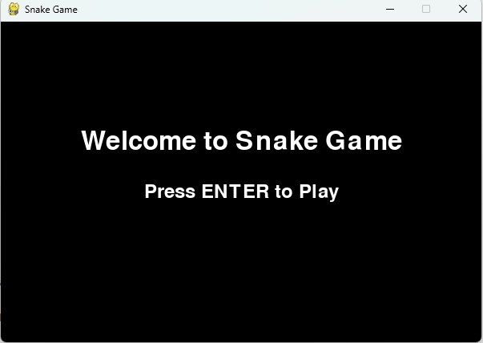
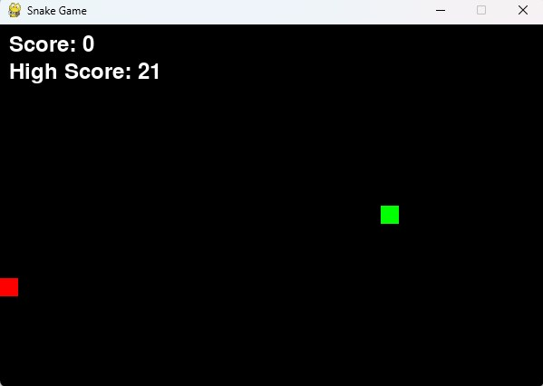

# Snake Game with High Scores

A game of Snake created in Python with use of Pygame facility. 
In the game the primary goal is to maneuver the snake and ensure it gets to eat foods and
get longer with the intention of scoring highest before running into ones own body.
## Features

- **Classic Snake Gameplay**: Use the arrow keys to control the snake and the red food blocks to make it grow and of course earn points.
- **High Scores Tracking**: The game also best five high scores with the respective player names it.
- **Live High Score Display**:  The score of the gamer with the highest previous record is recorded and shown in the game interface at a glance.
- **Pause and Exit Options**: Pause the game with `P` and return to the main menu with `ESC`.
- **Screen Wrapping**:  It is moved to the other edge of the screen if it gets off the borders of the screen area.

## Screenshots

### Main Menu


### Gameplay Screen


## Controls

- **Arrow Keys**: Move the snake up, down, left, or right.
- **P**: Pause or resume the game.
- **ESC**: Exit to the main menu.

## Installation and Setup

### Prerequisites

- **Python 3.x** installed on your system.
- **Pygame library** installed. Install it via pip:
  ```bash
  pip install pygame
  ```

### Running the Game

1. Download or clone this repository.
2. Open a terminal or command prompt in the directory containing `snake_game.py`.
3. Run the game using:
   ```bash
   python snake_game.py
   ```

### Files

- **`snake_game.py`**: Main Python script containing the game code.
- **`high_scores.json`**: JSON file where the game stores high scores. This file is created automatically after the first game session.

## How to Play

1. **Start the Game**: Start the game and type `Enter` at the first screen.
2. **Gameplay**: To control the movement of the snake and make it go down, right, left or up, use the arrow keys and the aim is to have the snake occupy the red blocks on the game map.
3. **Scoring**: So every time it occupies a food block the score also rises up by 1. This is true for all of it parts, including the snake that also increases in size, in terms of length.
4. **High Scores**: When all is said and done, if you have one of the five best scores, then you will be asked to type your name in. It will be written into high_scores.json and shown during Game Over screen.
5. **Pause and Exit**: Use `P` to pause the game or `ESC` to get out to the main menu of the game during playing.

## Game Mechanics and Features

- **Accurate Collision Detection**: In other words, it will eat the food only if the head of the snake lies on the cell of the same coordinates as the food cell.
- **Screen Wrapping**: The snake body circles the edges of the screen (for instance, if it goes beyond the left side of the screen it reappears on the right side of the screen).
- **High Score Management**: The game saves the highest scores in an external file in json format known as high_scores.json for purposes of storage information between different sessions.
- **User-Friendly Interface**: A main menu screen, a capability to pause the game, and Game Over screen gives a comfortable navigation.
## Known Issues and Future Improvements

- **Customizable Game Settings**: Allow players to change the game speed, grid size, and colors.
- **Enhanced High Score Storage**: Store dates and times for high scores.
- **Improved Collision Effects**: Add sound effects for eating food and Game Over.

## Acknowledgments

- **Python and Pygame**: Thanks to the developers of Python and Pygame for providing the tools to build this game.
- **Classic Snake Game Inspiration**: This game is inspired by the classic Snake game played on early mobile devices.
